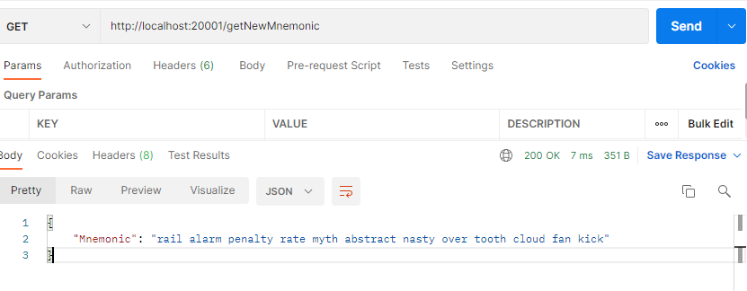

# 4팀

## 팀 이름

---

- 예슬이

## 깃 레포

---

- https://github.com/codestates/BTC2nd-04

[팀원 소개](https://www.notion.so/f97186c059054c4795d6e0a834ba61f9)

## 1. 선정 코인 소개 (Ethereum)

### 개요

이더리움은 2015년 7월 30일 비탈릭 부테린(Vitalik Buterin)이 개발하였다.
비탈릭 부테린은 가상화폐인 비트코인에 사용된 핵심 기술인 블록체인에 화폐 거래 기록뿐 아니라 계약서 등의 추가 정보를 기록할 수 있다는 점에 착안하여, 전 세계 수많은 사용자들이 보유하고 있는 컴퓨팅 자원을 활용해 이더리움 가상 머신(EVM)을 만들고, 이 플랫폼을 이용하여 SNS, 이메일, 전자투표 등 다양한 정보를 기록하는 시스템을 창안했다.

### 선정 이유

- 비트코인 이후 블록체인 생태계의 근본으로 여겨지는 코인
- 오랜 기간 발전하면서 다양한 라이브러리를 지원
- 현재 사용 중인 분야가 많아, 접목할 수 있는 사업모델이 많음
- 인지도가 높고, 미래에도 신뢰할 수 있는 코인

## 2. 프로젝트 소개

### 개요

이더리움 네트워크를 지원하는 블록체인 탐색기와 지갑을 개발하는 프로젝트로서, 웹 기반의 서비스를 제공합니다. 

### 기능

- 지갑
    - HD 지갑 생성 및 Keystore 불러오기
    - 잔액 조회 및 트랜잭션 기록 확인
    - 토큰 전송
- 익스플로러
    - 최신 블록 / 트랜잭션 조회
    - 해시를 통한 블록, 계정, 트랜잭션 검색
    - 계정 별 트랜잭션 내역 및 잔액 조회
- 데몬
    - Explorer 서버에서 블록 / 트랜잭션 데이터 실시간 수집
    - DB 저장 및 조회

### 탐색기

**환경**

- React (Front-End)
- Spring boot (Back-End)
- SQLite (Back-End 데몬 수집데이터)

**통신**

- React <=> Spring Boot :   Rest API 통신
- Spring Boot <=> ETH :    RPC 통신 (Web3j 라이브러리)

## 3. 프로젝트 상세

### 지갑

**환경**

- React (Front-End)
- Node.js (Back-End)

**통신**

- React <=> Node.js :   HTTP GET 통신
- Node.js<=> ETH :    RPC 통신 (Web3 라이브러리)
- Node.js<=> Spring Boot :    HTTP REST 통신

**기능 (화면 미구현)**

### 니모닉 지갑 제작

**니모닉 생성**

**니모닉 지갑 생성**

**지갑 불러오기**

---

### 지갑 다운로드

---

### 잔액 전송

**트랜잭션 생성**

**트랜잭션 전송**

---

### 잔액 및 트랜잭션 기록 조회

---

### 예상 가스 조회

### 탐색기

**환경**

- React (Front-End)
- Spring boot (Back-End)

**통신**

- React <=> Spring boot :   HTTP REST 통신
- Spring boot<=> ETH :    RPC 통신 (Web3 라이브러리)

**환경**

- React (Front-End)
- Spring boot (Back-End)
- SQLite (Back-End 데몬 수집데이터)

**통신**

- React <=> Spring Boot :   Rest API 통신
- Spring Boot <=> ETH :    RPC 통신 (Web3j 라이브러리)

**기능소개**

- 검색기능
    - 블록 / 트랜잭션 / 계정 해시값을 통한 검색
- 최근 블록 / 트랜잭션 조회
    - 데몬을 통해 수집된 데이터를 표시
- 상세정보
    - 블록/트랜잭션/계정 상세정보 조회
    - 계정 밸런스 및 트랜잭션 기록 조회

**화면**

### 데몬

일정시간 마다 블록체인 네트워크에 RPC 질의하여 새로운 블록을 탐지하고, 정보를 추출한 뒤 데이터베이스에 저장하는 프로그램

**DB 설계**

- Blocks 테이블

- Transactions 테이블

### API 리스트

협업 및 API 접근성 확보 차원에서 Swagger API 문서화

**월렛**

**탐색기**

### 마치고 난 후

- 어려웠던 점
    - 예상치 못하게 초반에 프로젝트 인원 한 명이 중도 하차하면서 2인 개발 체제로 시작
    - 개발 테스트를 위한 서버가 필요했으나, 구하기가 힘들어 시간이 지체
        - AWS 서버를 긴급하게 구하여 테스트
    - Node.js 의 경우 처음 시도하는 언어였기 때문에 시행착오가 많아 개발 시간이 지체
    - 본 업무와 병행하여 진행하기 위해, 프로젝트 인원들은 퇴근 후 새벽까지 개발
    
- 얻어가는 점
    - 새로운 개발환경과 언어를 사용하면서 기술 스펙트럼을 넓힐 수 있는 계기
    - 제한적인 시간과 환경에서 개발에 더욱 집중 할 수 있었던 경험
    - 여러 블록체인 네트워크를 이해하고 비교/경험 할 수 있는 시간
    - 팀원 간에 일정과 방향을 공유하고 협업하여 결과물을 만들어낸 경험
